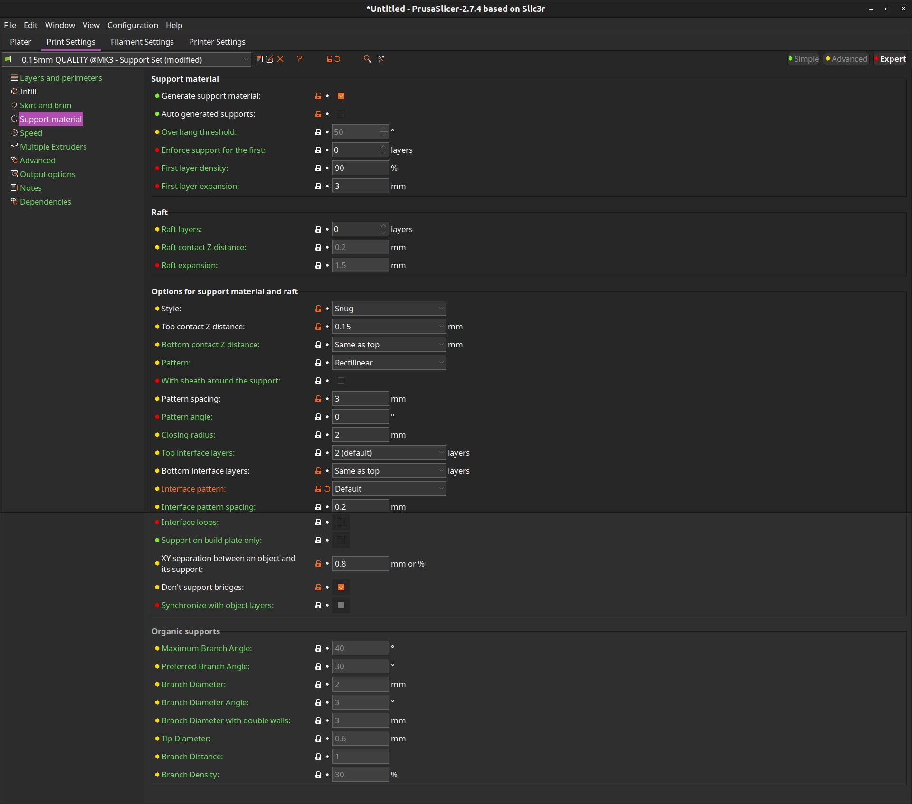

# 3D Printing (Know-how)

## Prusa MK3S Printer Settings
 

| Layer   Height  | Description  | Recommended Use |
| ----- | ----- | ----- |
| 0.05mm  | ULTRA DETAIL  | Extremely fine details, high-quality prints. Suitable for small models and intricate designs.  |
| 0.07mm  | ULTRA DETAIL  | Very high detail with slightly faster print time than 0.05mm. Good for detailed miniatures.  |
| 0.10mm  | DETAIL  | High quality with good detail, balancing speed and detail. Ideal for models where detail is important but time is a factor.  |
| 0.15mm  | QUALITY  | Good quality prints at a reasonable speed. Versatile for most general printing needs.  |
| 0.15mm  | SPEED  | Faster print time with decent quality. Suitable for larger models where detail is less critical.  |
| 0.20mm  | QUALITY  | Standard quality for most prints. Balanced print speed and quality.  |
| 0.20mm  | SPEED  | Faster prints with acceptable quality. Good for larger prints or prototypes.  |
| 0.30mm  | DRAFT  | Fastest printing mode with lower detail. Suitable for prototypes or large models where speed is prioritized over detail.  |

**Layer height** refers to the thickness of each individual layer of filament. It is about the details/tolerance in the vertical dimension, not the horizontal.     
 

| Infill Ratio  | Description  | Recommended Use  |
| ----- | ----- | ----- |
| \>= 0%  | No infill (hollow)  | For **very lightweight** models or when **only the outer shell is needed**.  |
| \>= 10%  | Low density  | Suitable for **lightweight brackets, non-load bearing decorative items** where strength is not critical.   |
| \>= 20%  | Moderate density  | Good for general use: **Enclosures, casings for electronics, hobby parts.**  |
| \>= 30%  | Moderate to high density  | Suitable for functional parts (**tool handles, small gears, functional prototypes**) that need more strength and durability.  |
| \>= 50%  | High density  | Provides significant strength, suitable for mechanical parts **(pan-tilt mechanisms, sliders, and guides)** or **load-bearing structures**.   |
| \>= 80%  | Solid  | Full density, maximum strength **(e.g., engine mounts, structural supports, holders)**. Used for parts that require high durability.   |

## Prusa MK3S Support Material Settings

## Flexible Materials
 

* **Flexible Material Types**: Thermoplastic elastomers (TPE) or thermoplastic polyurethane (TPU) materials.   
  * Preheat can be set just as PLA one, only if it does not have TPU type\!   
  * Flexible filament infill **ratio** (PrusaSlicer): **8%**   
  * For more: [How to print with flexible filament](https://blog.prusa3d.com/how-to-print-with-flexible-filament_29672/)

   
### Distortion Issue Solution Settings:

* **Infill ratio:** 10%   
* **Print Speed:** 20-30 mm/s   
* **Temperature:** 220 \- 240°C   
* **Cooling (Fan) Speed:** 40%   
* **Extrusion multiplier:** 1.1   
* **Extruder:** 240 °C   
* **Bed:** 40 °C   
* **Enable auto cooling:** on   
* **Fan speed:** 30-40% 
* **Fan disabled for first 2 layers
* **Enable fan if layer print time is below:** 100   
* **Slow down if layer print time is below:** 20   
* **Min print speed:** 10 mm/s   
* **Max volumetric speed:** 3 mm³/s 

